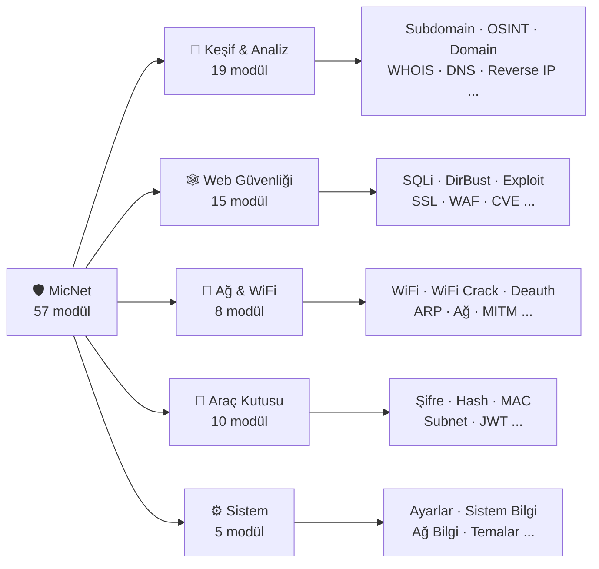
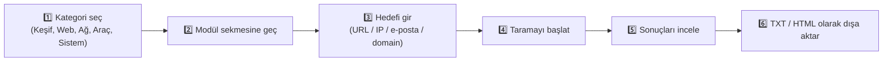

<div align="center">


# MicNet

### Açık Kaynaklı, Çok Modüllü Siber Güvenlik Test Aracı

**57 modül · 5 kategori · tek uygulama**

Ağ keşfi ve port tarama · WiFi analizi · OSINT · Web güvenlik testleri · Şifre & hash araçları

<p>


</p>
<p>


</p>

<p>
<a href="https://github.com/yagzalp/MicNet/releases/latest">

</a>
</p>

<p>
  <a href="#-neden-micnet"><b>Neden MicNet?</b></a> ·
  <a href="#-hızlı-başlangıç"><b>Hızlı Başlangıç</b></a> ·
  <a href="#-modül-haritası"><b>Modül Haritası</b></a> ·
  <a href="#-modüller-detaylı"><b>Modüller</b></a> ·
  <a href="#️-yapılandırma"><b>Yapılandırma</b></a> ·
  <a href="#-sık-sorulan-sorular"><b>SSS</b></a>
</p>

</div>

<br>

> MicNet; ağ haritalamadan WPA şifresi kırmaya, SQL injection taramasından OSINT istihbaratına kadar bir sızma testi sürecinde ihtiyaç duyacağınız **57 farklı aracı tek bir masaüstü uygulamasında** birleştirir. Kurulum derdi yok: AppImage'i indirin, çift tıklayın, başlayın.

<br>

## 🩹 Bilinen Sorunlar

> **AppImage bazı dağıtımlarda açılmayabilir.**
> Mevcut derleme, güncel bir glibc (2.43+) gerektiren kütüphanelerle paketlenmiş. Arch Linux / Manjaro gibi rolling-release dağıtımlarda sorunsuz çalışır; Ubuntu, Debian, Fedora gibi bazı stabil dağıtımlarda **`GLIBC_2.43 not found`** hatasıyla karşılaşabilirsiniz.
>
> **Çözüm:** Bu durumda [Kaynak Koddan Kurulum](#-kaynak-koddan-kurulum) bölümündeki adımları izleyin, sorunsuz çalışır. AppImage'ın daha eski/uyumlu bir ortamda yeniden derlenmesi planlanıyor.

<br>

## 💡 Neden MicNet?

<table>
<tr><td width="40">🧩</td><td><b>Hepsi bir arada</b><br>57 modül tek arayüzde — ağdan web'e, WiFi'dan OSINT'e ayrı ayrı araç kurmaya gerek yok</td></tr>
<tr><td>⚡</td><td><b>Kurulumsuz kullanım</b><br>AppImage'e çift tıkla, masaüstü kısayolu otomatik gelir</td></tr>
<tr><td>🇹🇷</td><td><b>Türkçe arayüz & çıktı</b><br>Port açıklamaları, HTTP kodları ve bulgular anlaşılır Türkçe ile sunulur</td></tr>
<tr><td>🎨</td><td><b>5 farklı tema</b><br>Koyu, Açık, Mavi, Yeşil, Mor ve Kırmızı temalar arasında anında geçiş</td></tr>
<tr><td>🔑</td><td><b>API anahtarı zorunlu değil</b><br>Shodan / VirusTotal / SecurityTrails / AbuseIPDB entegrasyonu isteğe bağlıdır</td></tr>
<tr><td>🪶</td><td><b>Şeffaf & açık kaynak</b><br>Her modül sade Python dosyaları halinde, GPL-3.0 ile özgürce incelenebilir/değiştirilebilir</td></tr>
</table>

<br>

## 🚀 Hızlı Başlangıç

En hızlı yol — **kurulum yok, derleme yok**:

```
1️⃣  Releases sayfasından MicNet-x86_64.AppImage'ı indir
2️⃣  chmod +x MicNet-x86_64.AppImage
3️⃣  Çift tıkla, çalıştır
```

<div align="center">

**[⬇️ En Son Sürümü İndir](https://github.com/yagzalp/MicNet/releases/latest)**

</div>

İlk çalıştırmada MicNet otomatik olarak masaüstünüze ve uygulama menünüze bir kısayol ekler — bir sonraki açılışta doğrudan oradan başlatabilirsiniz. AppImage açılmazsa yukarıdaki [Bilinen Sorunlar](#-bilinen-sorunlar) bölümüne bakın.

<br>

## 🛠 Kaynak Koddan Kurulum

**Gereksinimler:** Python 3.8+, pip, GTK3 kütüphaneleri, internet bağlantısı (bazı modüller API kullanır). WiFi kırma modülleri için ayrıca `aircrack-ng` ve monitor moda uygun bir kablosuz adaptör gerekir.

<table>
<tr><th>Dağıtım</th><th>Komutlar</th></tr>
<tr>
<td><b>Debian / Ubuntu / Mint</b></td>
<td>

```bash
sudo apt install python3 python3-pip python3-gi gir1.2-gtk-3.0
git clone https://github.com/yagzalp/MicNet.git && cd MicNet
pip install -r requirements.txt
python3 main.py
```

</td>
</tr>
<tr>
<td><b>Arch Linux</b></td>
<td>

```bash
sudo pacman -S python python-pip gtk3 python-gobject
git clone https://github.com/yagzalp/MicNet.git && cd MicNet
pip install -r requirements.txt
python3 main.py
```

</td>
</tr>
<tr>
<td><b>Fedora</b></td>
<td>

```bash
sudo dnf install python3 python3-pip gtk3 python3-gobject
git clone https://github.com/yagzalp/MicNet.git && cd MicNet
pip install -r requirements.txt
python3 main.py
```

</td>
</tr>
</table>

**Masaüstü kısayolu istiyorsanız** (opsiyonel):

```bash
chmod +x install.sh && ./install.sh
```

<br>

## 🗺 Modül Haritası



<br>

## 📦 Modüller (Detaylı)

> Aşağıdaki açıklamalar her modülün adına ve genel işlevine dayanan kısa özetlerdir.

### 🔎 Keşif & Analiz — 19 modül

| Modül | Ne işe yarar |
|---|---|
| **Subdomain** | Bir domainin alt alan adlarını (subdomain) kelime listesiyle tarar |
| **OSINT** | E-posta, domain, kullanıcı adı ve IP için açık kaynak istihbaratı toplar |
| **Domain** | Domain hakkında genel analiz yapar (DNS, sunucu, web durumu) |
| **WHOIS** | Domainin kayıt sahibi, kayıt/bitiş tarihi gibi bilgilerini sorgular |
| **DNS** | A, AAAA, MX, NS, TXT gibi DNS kayıtlarını sorgular |
| **Reverse IP** | Aynı sunucu IP'sinde barınan diğer domainleri bulur |
| **Konum** | Bir IP adresinin coğrafi konumunu (ülke/şehir) tespit eder |
| **Port** | Hedefteki açık portları ve üzerlerinde çalışan servisleri tarar |
| **URL** | HTTP güvenlik başlıklarını ve genel güvenlik durumunu analiz eder |
| **CMS** | Hedefin hangi CMS (WordPress, Joomla, Drupal vb.) ile çalıştığını tespit eder |
| **DNSZone** | DNS zone transfer açığı olup olmadığını kontrol eder |
| **Headers** | HTTP response başlıklarını listeler ve yorumlar |
| **Robots** | `robots.txt` dosyasını analiz ederek gizlenmiş yolları ortaya çıkarır |
| **Metadata** | Dosyalardaki (görsel/doküman) gizli meta verileri çıkarır |
| **Status** | HTTP durum kodlarını (200, 403, 404...) açıklamalı gösterir |
| **S3** | Açık veya yanlış yapılandırılmış bulut depolama (S3) bucket'larını arar |
| **Tech** | Sitenin kullandığı teknoloji/framework/kütüphaneleri tespit eder |
| **Links** | Bir sayfadaki tüm bağlantıları (link) çıkarır |
| **Emails** | Bir sayfa veya domainden e-posta adreslerini toplar |

### 🕸️ Web Güvenliği — 15 modül

| Modül | Ne işe yarar |
|---|---|
| **SQLi** | Error-based ve boolean-based yöntemlerle SQL injection açığı tarar |
| **DirBust** | Gizli dizin ve dosyaları brute-force ile bulur |
| **Exploit** | Admin paneli, açık dosya ve varsayılan şifre kombinasyonlarını otomatik tarar |
| **SSL** | SSL/TLS sertifikasının geçerliliğini ve yapılandırmasını kontrol eder |
| **WAF** | Web Application Firewall (Cloudflare, ModSecurity, AWS WAF vb.) tespiti yapar |
| **CVE** | Tespit edilen yazılım/sürüme ait bilinen CVE kayıtlarını arar |
| **Blacklist** | Bir IP'nin kötüye kullanım/blacklist geçmişini sorgular |
| **EPosta** | E-postanın bilinen veri sızıntılarında (HIBP) geçip geçmediğini kontrol eder |
| **XSS** | Cross-Site Scripting (XSS) açığı olup olmadığını test eder |
| **Redirect** | Open redirect açığı olup olmadığını kontrol eder |
| **LFI** | Local File Inclusion (LFI) açığı tarar |
| **Komut** | Komut enjeksiyonu (command injection) açığını test eder |
| **CORS** | CORS yapılandırma zafiyetlerini kontrol eder |
| **Yedek** | Unutulmuş yedek/backup dosyalarını arar |
| **SHead** | Güvenlik başlıklarının (HSTS, CSP vb.) eksik olup olmadığını denetler |

### 📡 Ağ & WiFi — 8 modül

| Modül | Ne işe yarar |
|---|---|
| **WiFi** | Çevredeki kablosuz ağları tarar |
| **WiFi Crack** | Yakalanmış handshake (.cap) dosyasından WPA/WPA2 şifresini kırmaya çalışır |
| **Deauth** | WiFi istemcilerini ağdan geçici olarak düşürür (deauth) |
| **ARP** | ARP spoofing / MITM saldırılarını tespit eder |
| **Ağ** | Yerel ağdaki cihazları IP, MAC, üretici ve açık portlarıyla haritalar |
| **MITM** | Ortadaki adam (man-in-the-middle) senaryolarını simüle eder/tespit eder |
| **Honeypot** | Sahte servis/tuzak sunucu oluşturup saldırı denemelerini izler |
| **Cihazlar** | Ağdaki cihazları listeler ve detaylarını gösterir |

### 🧰 Araç Kutusu — 10 modül

| Modül | Ne işe yarar |
|---|---|
| **Şifre** | Rastgele, güçlü şifre üretir |
| **Password Test** | Girilen şifrenin gücünü ve tahmini kırılma süresini hesaplar |
| **Hash** | Metinlerin MD5, SHA ailesi, Blake2 gibi hash değerlerini hesaplar |
| **MAC** | MAC adresinden üretici (OUI) bilgisini bulur |
| **Kodla** | Base64 / URL / HTML gibi encode-decode işlemleri yapar |
| **Subnet** | Subnet / CIDR hesaplamaları yapar |
| **Mail** | Test amaçlı e-posta gönderim simülasyonu yapar |
| **Password Leak** | Şifrenin bilinen veri sızıntılarında olup olmadığını kontrol eder |
| **JWT** | JWT token'larını çözümler ve analiz eder |
| **File Hash** | Dosyaların hash değerini hesaplayıp doğrular |

### ⚙️ Sistem — 5 modül

| Modül | Ne işe yarar |
|---|---|
| **Ayarlar** | API anahtarlarını ve genel uygulama ayarlarını yönetir |
| **Sistem Bilgi** | Bilgisayarın donanım ve işletim sistemi bilgilerini gösterir |
| **Ağ Bilgi** | Yerel ağ arayüzü ve IP bilgilerini gösterir |
| **Süreçler** | Çalışan sistem süreçlerini (process) listeler |
| **Temalar** | Uygulamanın renk temasını değiştirir (Koyu/Açık/Mavi/Yeşil/Mor/Kırmızı) |

<br>

## 🖱️ Kullanım Akışı



Tarama gerektiren modüllerde ilerleme çubuğu üzerinden anlık durum takip edilir. Herhangi bir sekmedeyken **"Çıktıyı Kaydet"** butonuyla ekrandaki sonucu `.txt` veya `.html` olarak dışa aktarabilirsiniz.

<br>

## ⚙️ Yapılandırma

Aşağıdaki servisler bazı modüllerin (ör. IP itibar sorgulama, gelişmiş domain analizi) kapsamını genişletir. **Tamamı isteğe bağlıdır** — girilmese de modüller temel işlevleriyle çalışmaya devam eder.

| Servis | Ne için kullanılır |
|---|---|
| **Shodan** | IoT/ağ cihazı taraması, gelişmiş IP sorgulama |
| **VirusTotal** | Dosya/URL/domain zararlı yazılım analizi |
| **SecurityTrails** | Domain ve subdomain istihbaratı |
| **AbuseIPDB** | IP itibar/kötüye kullanım sorgulama |

Anahtarlar, uygulama içindeki **Ayarlar** sekmesinden girilir ve şurada saklanır:

```
~/.config/micnet/config.json
```

```json
{
    "shodan": "ANAHTARINIZ",
    "virustotal": "ANAHTARINIZ",
    "securitytrails": "ANAHTARINIZ",
    "abuseipdb": "ANAHTARINIZ"
}
```

<br>

## 🧱 Proje Yapısı

```
MicNet/
├── modules/              # Tüm modül dosyaları (57 modül)
├── app.py                # Arayüz mantığı / ana uygulama sınıfı
├── main.py               # Giriş noktası
├── icon.svg              # Uygulama ikonu
├── micnet.desktop         # Linux masaüstü kısayolu şablonu
├── install.sh             # Kaynak koddan kurulumda kısayol oluşturur
├── run.sh                 # Bağımlılık kontrolü + başlatma betiği
├── requirements.txt      # Python bağımlılıkları
└── LICENSE               # GPL-3.0 lisansı
```

<br>

## ❓ Sık Sorulan Sorular

<details>
<summary><b>API anahtarı girmezsem uygulama çalışmaz mı?</b></summary><br>
Çalışır. API anahtarları tamamen isteğe bağlıdır; yalnızca bazı modüllerin kapsamını genişletir (örn. Shodan olmadan IP sorgulaması temel seviyede kalır).
</details>

<details>
<summary><b>AppImage'ı çalıştırdım ama açılmadı, "GLIBC_2.43 not found" hatası aldım. Ne yapmalıyım?</b></summary><br>
Bu bilinen bir uyumluluk sorunu (yukarıdaki <a href="#-bilinen-sorunlar">Bilinen Sorunlar</a> bölümüne bakın). Bu durumda <a href="#-kaynak-koddan-kurulum">Kaynak Koddan Kurulum</a> adımlarını izleyerek sorunsuz çalıştırabilirsiniz.
</details>

<details>
<summary><b>WiFi modülleri her adaptörle çalışır mı?</b></summary><br>
Hayır. WiFi Crack ve Deauth modülleri <b>monitor mod destekleyen</b> bir kablosuz adaptör ve sistemde kurulu <code>aircrack-ng</code> gerektirir.
</details>

<details>
<summary><b>Masaüstü kısayolu otomatik geliyor mu?</b></summary><br>
AppImage'ı ilk çalıştırdığınızda evet, otomatik olarak hem masaüstünüze hem uygulama menünüze kısayol eklenir. Kaynak koddan kurulumda ise <code>./install.sh</code> çalıştırmanız gerekir.
</details>

<details>
<summary><b>Windows/macOS desteği var mı?</b></summary><br>
Hayır. MicNet GTK3 tabanlıdır ve yalnızca Linux için tasarlanmıştır.
</details>

<br>

## ⚠️ Sorumluluk Reddi

> MicNet **yalnızca eğitim ve yasal sızma testi** amaçlıdır.

- Bu aracı **yalnızca kendi ağınızda** veya **yazılı izniniz olan** sistemlerde kullanın.
- İzinsiz sistemlere yönelik tarama, brute-force veya kimlik bilgisi denemesi bulunduğunuz ülkenin yasalarına göre **suç teşkil edebilir**.
- Aktif ağ taraması hedef ağın kullanım koşullarını ihlal edebilir.
- Geliştirici, bu aracın kötüye kullanımından doğacak zararlardan **sorumlu tutulamaz**.

<br>

## 📄 Lisans

Bu proje **GPL-3.0** lisansı altındadır — detaylar için [LICENSE](LICENSE) dosyasına bakın.

<br>

<div align="center">

### ⭐ Projeyi Beğendiyseniz

Bir yıldız bırakmak, projenin gelişmesine katkı sağlar ve daha fazla kişiye ulaşmasına yardımcı olur.

**[⭐ Star ver](https://github.com/yagzalp/MicNet)** · **[🐛 Hata bildir](https://github.com/yagzalp/MicNet/issues)** · **[🔀 Fork'la](https://github.com/yagzalp/MicNet/fork)**

<br>

Made with 🛡️ by [**yagzalp**](https://github.com/yagzalp)

</div>
